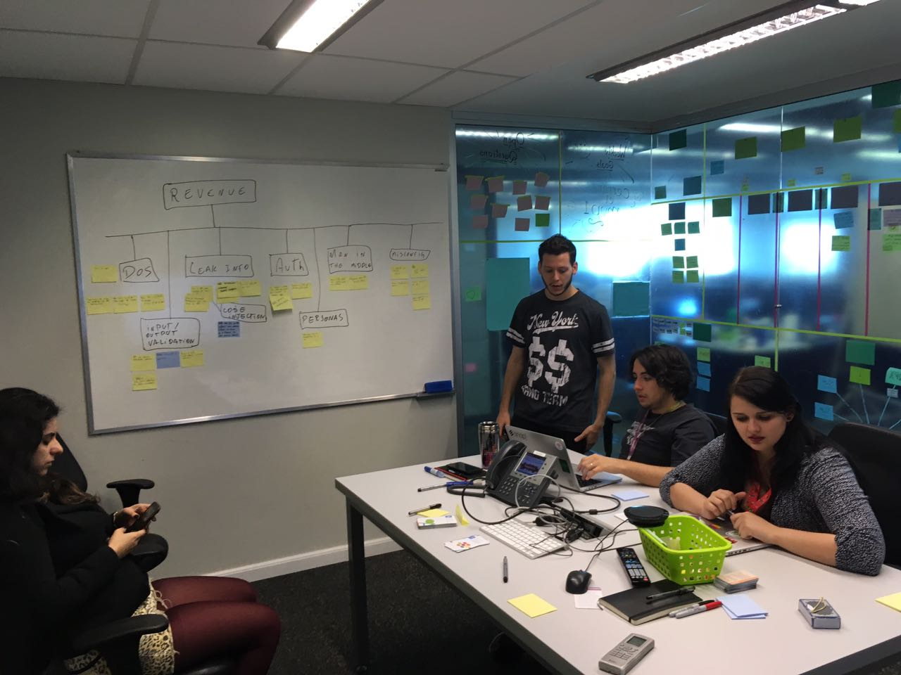

# Segurança desde a inception

---

## Quem sou eu

 

Jeff Stachelski @jeffhsta

---

## Motivação

- Mindset sobre segurança nos times
- Estar preparado para o pior
- Um passo a frente dos riscos

---

## Segurança e ágil?

- Há práticas para:
 - Débitos técnicos
 - Fazer o mínimo e o mais simples possível
 - Focar em qualidade

---

## O que fazemos hoje

- Daily ou stand up meeting
- Retro
- Showcase
- 3 amigos
- Pair programming
- Continous Integration
- TDD, BDD

---

## E quanto as práticas de segurança?

---

## Criar o mindset na inception

- Ter um champion de segurança
- Pensar em segurança nas definições de features

---

## Threat Modeling

---

---

---

## Resultados

- Árvore de ameaças
- Overview das possiveis ameaças
- Action items
- Visualização de ameaças que não são de controle nosso

---

## Mas não sou um cybersecurity engineer

---

## Theat modeling pronto, e agora?

- Trabalhar nos action items
- Continuar em mente as ameaças mapeadas
- Manter o mindset de segurança no time

---

## Jogos para fazer com o time

---

## Ainda há muito mais a se trabalhar

 

**https://github.com/jeffhsta/security-guide-for-developers**

---

# Muito Obrigado!

## Perguntas?

https://github.com/jeffhsta/tdc2016

